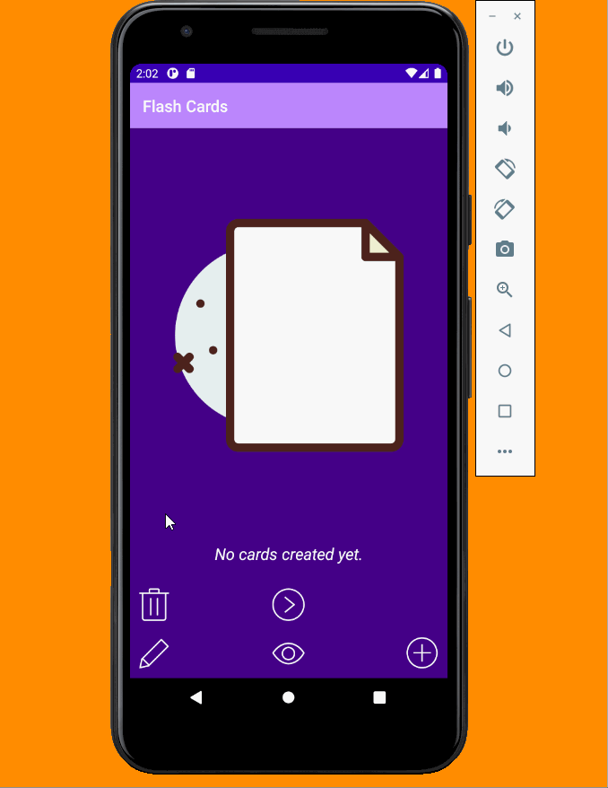
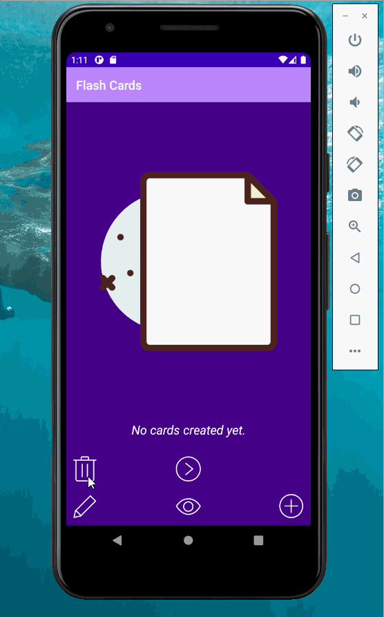
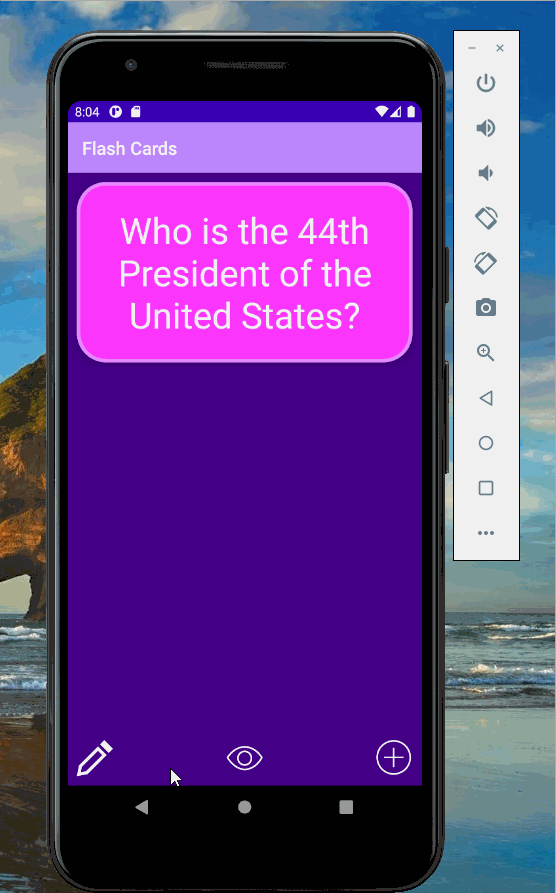
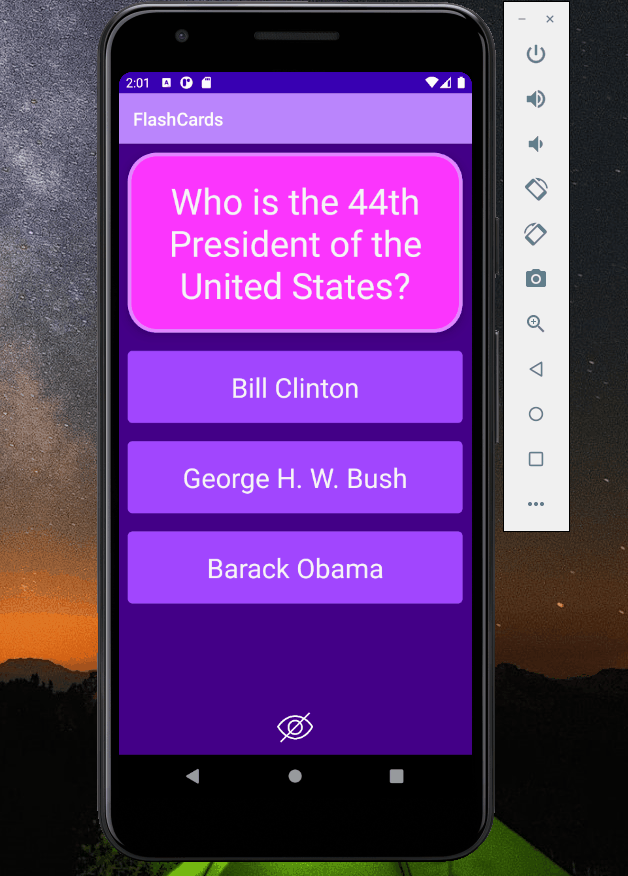

## Flash Cards

### App Description
FlashCards is an Android application that allows users to create virtual flash cards for memorization and learning.

### Tools Used
Android Studio, Android SDK 23, Java

## Lab 4

### App Description
`TODO://` Add app description

### App Walk-though

 

## Required
- [x] User sees a transition animation when going from the main screen to the add card screen.
- [x] User sees a reveal animation when the flashcard is tapped and the answer is shown
- [x] User sees flashcards animating in / out when the 'next' button is tapped

## Optional
- [x] Extra styling is added!
- [ ] User sees a countdown timer for each question
- [ ] User sees a 'card flip' animation when the card is tapped
- [ ] User sees a celebration animation with confetti when they answer a question correctly

## Lab 3

### App Description
FlashCards v3 has more functionality. The user can now keep any created cards upon the next app launch. FlashCards uses the persistence library Room to store cards locally on the phone. When more than one flash card is present, users are allowed to cycle through using the next arrow at the bottom of the screen.

Furthermore, users can delete cards they no longer want by clicking the trash icon. Cards will no longer be shown sequentially but in a random order. And users are able to edit and create cards that contain multiple choice answers as they browse their deck of cards.

Empty file icon credits to: Darius Dan of flaticon.com

### App Walk-though

 

## Required
- [x] User can create a card and still see their created card when the app is relaunched.
- [x] User can create multiple cards and browse through all created cards.

## Optional
- [x] User can delete a card and no longer see it in their deck anymore.
- [x] Flashcards are shown in random order instead of the order they were created in.
- [x] User can edit a card and see the edit saved when they browse through their deck of cards.
- [x] User can create flashcards with multiple answers and be able to browse through cards with multiple choice answers shown.

## Lab 2

### App Description
FlashCards v2 has less limited functionality. The app can now display a new card's question and answer. The new question screen is accessed by the ‘+’ button and
returns to the main screen using either the ‘x’ button or the Save ‘arrow’ button, which will save the entered text to display as a new question. Cards are still not stored locally and new additions will overwrite the current question.

Further functionality is added. A user can edit ‘pencil’ a card question and all answer options. If any of these components are missing in an attempted save, a error message is shown. Lastly,
when a card is edited or created a message is also shown. This is because the Edit and Create functionalities share the same Activity. The colors for correct/wrong options are still do not reset.

### App Walk-though
 

## Required
- [x] User can click on a ‘+’ button that takes the user to new ‘Add Card Screen’.
- [x] The 'Add Card Screen' has a cancel button to take the user back to the main screen.
- [x] User can enter and submit a Question and Answer through the 'Add Card Screen'.
- [x] User will see the card they just created on the main screen when they press the 'Save Button'.
- [x] Push your progress to GitHub!

## Optional
- [x] User can edit a card
- [x] An error message is shown if the user doesn't enter both a Question and an Answer.
- [x] A notification is shown if the card was created successfully.
- [x] User can also enter multiple choice answers when creating a card.
- [x] App is further styled and customized!

## Lab 1

### App Description
FlashCards v1 has limited functionality. The app currently displays one question and answer(hard-coded).
Toggle functionality added between question and answer. 
There was a further addition of multiple choice selection for answers(hard-coded). 
The correct answer highlights green, while the incorrect answers highlight red(no reset). 
There is a toggle icon for visibility which hides the multiple choice answers or displays them.
Some styling was added for a retro purple-pink theme.

### App Walk-though

 

## Required
- [x] Create New Project in Android Studio.
- [x] Add a view for the front side of the flashcard to display the question.
- [x] Add a view for the back side of the flashcard to display the answer.
- [x] Build in logic to show the answer side when the card is tapped.
- [x] Push code to GitHub.
## Optional
- [x] Toggle the flashcard between the question side and the answer side.
- [x] Style the question and answer side of the card to better distinguish between the two sides.
- [x] Add selectable multiple choice answers beneath the card.
- [x] Change the background color of the multiple choice answers when clicked to indicate whether the question was answered correctly.
- [x] Further customize and style the card.
